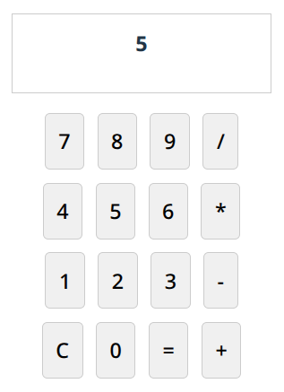

# Gremllm React


You head down to the crossroads and meet a tall man wearing a tall black hat. He carries with him a cage -- not very large, he lifts it with one hand, but it is shrouded with a black cloth. "What's in there?" you ask. "Gremllm," the man says, straight-faced. "What does it do?" you reply, eyebrow raised. He stares at you for a long moment, and says quietly "Whatever you ask. More or less. Good luck." The world flashes and you are back to staring at your code editor. It has only:

```typescript
import Gremllm from 'gremllm-react';

export function App() {
  return <Gremllm prompt="A simple calculator with buttons for +, -, *, / and a display" />
}
```

Nervously you type `npm run dev` into your terminal. You open your browser and see a fully functional calculator with buttons, display, and working arithmetic.



It works! More or less.

---


> Build-time (Vite) LLM-generated React components

Transform natural language prompts into React components at build time. Write `<Gremllm prompt="A calculator" />` and get a fully functional calculator component generated by AI. Maybe.

**See the [demo code](examples/demo/) and an [example demo deployment](https://awwaiid.github.io/gremllm-react/).**

## Features

- 🏗️ **Build-time generation** - Components generated during build, zero runtime overhead
- 🎯 **Simple API** - Write `<Gremllm prompt="..." />`
- ⚡ **Caching** - Generated components are cached to avoid regenerating on every build
- 🔧 **TypeScript support** - Full TypeScript support with proper types
- 🎨 **Production ready** - hah!
- 🔌 **Vite plugin** - Easy integration with Vite-based projects

## Installation

```bash
npm install gremllm-react
```

## Quick Start

1. **Add the Vite plugin:**

```ts
// vite.config.ts
import { defineConfig } from 'vite'
import react from '@vitejs/plugin-react'
import { gremllmPlugin } from 'gremllm-react/vite'

export default defineConfig({
  plugins: [
    react(),
    gremllmPlugin({
      defaultProvider: 'openai',
      model: 'gpt-4o-mini',
    })
  ],
})
```

2. **Set up environment variables:**

```bash
# .env
OPENAI_API_KEY=your_openai_api_key_here
```

3. **Use in your React components:**

```tsx
import Gremllm from 'gremllm-react';

export function App() {
  return (
    <div>
      <h1>My App</h1>
      <Gremllm prompt="A simple calculator with buttons for +, -, *, / and a display" />
      <Gremllm prompt="A todo list where you can add and remove items" />
    </div>
  );
}
```

4. **Build your app:**

```bash
npm run build
```

The `<Gremllm>` components will be replaced with actual, generated React components at build time!

## How It Works

1. **Build Time**: The Vite plugin scans your code for `<Gremllm prompt="..." />` tags
2. **Generation**: For each prompt, it calls the LLM API to generate a React component
3. **Caching**: Generated components are cached based on prompt hash
4. **Replacement**: The `<Gremllm>` tags are replaced with the generated components
5. **Production**: Your built app contains only the generated components, no runtime overhead

## Configuration

### Vite Plugin Options

```ts
gremllmPlugin({
  // LLM Provider (default: 'openai')
  defaultProvider: 'openai' | 'anthropic',
  
  // Model to use (default: 'gpt-4o-mini' for OpenAI)
  model: 'gpt-4o-mini',
  
  // API Keys (defaults to environment variables)
  openaiApiKey: 'your-key',
  anthropicApiKey: 'your-key',
  
  // Cache directory (default: '.gremllm-cache')
  cacheDir: '.gremllm-cache',
  
  // Enable/disable generation (default: true)
  enabled: true,
})
```

### Environment Variables

```bash
OPENAI_API_KEY=your_openai_api_key_here
ANTHROPIC_API_KEY=your_anthropic_api_key_here
```

## Component Props

The `Gremllm` component accepts these props:

```tsx
<Gremllm 
  prompt="Description of what you want"
  fallback={<div>Loading...</div>}  // Optional fallback content
  className="my-class"              // Additional props passed through
  style={{ margin: '1rem' }}       // Styling props
/>
```

## Examples

### Calculator
```tsx
<Gremllm prompt="A calculator with number buttons, operations (+, -, *, /), equals, and clear" />
```

### Todo List
```tsx
<Gremllm prompt="A todo list with input field, add button, and items that can be checked off and deleted" />
```

### Color Picker
```tsx
<Gremllm prompt="A color picker that shows RGB values and a preview of the selected color" />
```

### Timer
```tsx
<Gremllm prompt="A countdown timer starting at 60 seconds with start, stop, and reset buttons" />
```

## Development vs Production

### Development Mode
- Shows placeholder with prompt preview
- Plugin generates components in real-time
- Hot reload supported

### Production Mode
- Components are pre-generated at build time
- Zero runtime overhead
- No LLM API calls needed

## Caching

Generated components are cached in `.gremllm-cache/` directory:

```
.gremllm-cache/
├── a1b2c3d4.json  # Calculator component
├── e5f6g7h8.json  # Todo list component
└── ...
```

### Cache Management

**Manual cache clearing:**
```bash
# Clear all cached components
rm -rf .gremllm-cache/

# Clear specific component (find hash from filename)
rm .gremllm-cache/a1b2c3d4.json
```

**Cache strategies:**
- **Commit the cache** to avoid regenerating components across builds/deployments
- **Add to .gitignore** to always generate fresh components
- **Selective clearing** - delete specific component cache files to regenerate only those components

**Cache configuration:**
```ts
// vite.config.ts
gremllmPlugin({
  cacheDir: '.my-custom-cache',  // Custom cache directory
  // ... other options
})
```

**When cache is used:**
- Cache is based on prompt hash - identical prompts reuse cached components
- Changing a prompt will generate a new component
- Cache persists across builds unless manually cleared

## TypeScript Support

Full TypeScript support is included:

```tsx
import Gremllm, { type GremllmProps } from 'gremllm-react';

// Type-safe props
const MyComponent: React.FC<GremllmProps> = ({ prompt, ...props }) => (
  <Gremllm prompt={prompt} {...props} />
);
```

## Advanced Usage

### Conditional Generation

```tsx
// Only generate in development
<Gremllm 
  prompt="Debug panel with state inspector" 
  fallback={process.env.NODE_ENV === 'production' ? null : undefined}
/>
```

### Multiple Providers

```ts
// vite.config.ts
gremllmPlugin({
  defaultProvider: process.env.PREFERRED_PROVIDER || 'openai',
  openaiApiKey: process.env.OPENAI_API_KEY,
  anthropicApiKey: process.env.ANTHROPIC_API_KEY,
})
```

## Limitations

- Requires Vite (built for Vite's plugin system)
- Components are generated at build time (not runtime)
- Requires API keys for LLM providers
- Generated components are self-contained (no external dependencies)

## Contributing

1. Clone the repository
2. Install dependencies: `npm install`
3. Build: `npm run build`
4. Test with the demo: `cd examples/demo && npm install && npm run dev`

## License

MIT

---

**Note**: This is an experimental project. Generated components should be reviewed before production use. The quality depends on the LLM provider and prompt quality.
